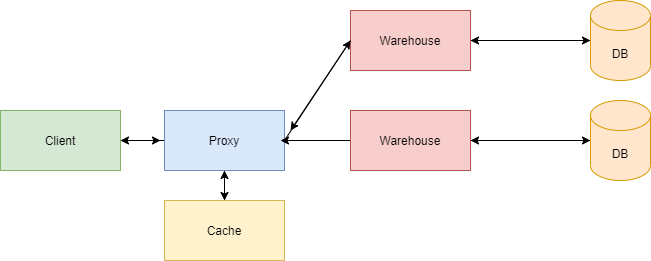

# Checkpoint 1

Services: 
- One proxy that will communicate with clients;
- Two warehouses that will connect to the database;
- Two databases;
- Cache;

Description of outbound API endpoints:
A client can communicate with servers using the following API:

- `get` `/api/v1/car/<id>` - get a specific car

```xml
<car>
	<car_id></car_id>
	<company></company>
  <model></model>
  <color></color>
	<production_year></production_year>
</car>
```

- `get` `/api/v1/cars` - get a list of cars

```xml
<car_list>
	<car>
		<!-- car body -->
	</car>
	<!-- more cars -->
</cars_list>
```

- `post` `/api/v1/car` - post a new car

```xml
<car>
	<company></company>
  <model></model>
  <color></color>
	<production_year></production_year>
</car>
```
List of technologies:
- Redis;
- Ruby;
- CassandraDB;
- Docker;
- ... TBD.

# Diagram 


